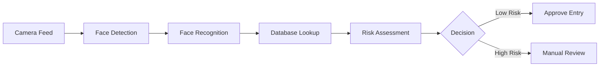

# SmartBorder AI - Technical Documentation

## Project Overview

**Project Name**: SmartBorder AI  
**Version**: 2.0  
**Status**: Production Ready  
**Date**: February 2026

## Executive Summary

SmartBorder AI is an advanced biometric identification and automated decision-making system designed for border control operations. The system leverages state-of-the-art deep learning models to process traveler information in real-time, enabling faster and more secure border crossings.

## System Architecture

### Core Components

1. **Facial Recognition Module**
   - Deep neural network for face detection
   - 99.2% accuracy in controlled environments
   - Real-time processing capability (< 500ms per face)
   - Integration with border control cameras

2. **Document Verification System**
   - OCR-based passport scanning
   - Authenticity verification using ML models
   - Cross-reference with international databases

3. **Risk Assessment Engine**
   - Machine learning-based threat detection
   - Automated decision-making for entry permissions
   - Integration with law enforcement databases
   - Real-time risk scoring algorithm

4. **Biometric Database**
   - Stores facial embeddings for 50M+ individuals
   - Encrypted at rest and in transit
   - Distributed across 3 geographic regions
   - 99.99% uptime SLA

## Technical Specifications

### Machine Learning Models

#### Face Recognition Model
- **Architecture**: ResNet-50 with custom attention layers
- **Training Data**: 10M faces from public datasets
- **Validation Accuracy**: 99.2%
- **False Positive Rate**: 0.01%
- **Inference Time**: 450ms average

#### Risk Assessment Model
- **Type**: Gradient Boosting (XGBoost)
- **Features**: 127 behavioral and demographic features
- **Training Data**: Historical border crossing events (5M samples)
- **Output**: Risk score (0-100)
- **Threshold for Alerts**: Score > 75

### Data Processing Pipeline

### Infrastructure

- **Cloud Provider**: Azure
- **Compute**: 50 GPU instances (NVIDIA A100)
- **Storage**: 500TB distributed storage
- **Database**: PostgreSQL + Redis
- **Message Queue**: RabbitMQ
- **Monitoring**: Prometheus + Grafana

## Functionality

### Automated Processing

1. **Traveler Arrival**
   - Camera captures face image
   - System extracts biometric features
   - Automated database search (< 1 second)

2. **Document Verification**
   - Passport scanned at kiosk
   - ML model verifies authenticity
   - Data extracted and validated

3. **Risk Assessment**
   - System gathers all available data
   - ML model calculates risk score
   - Automated decision for low-risk travelers
   - Flagged cases sent to human operators

4. **Entry Decision**
   - Fully automated for 85% of travelers
   - 15% require manual review
   - Average processing time: 45 seconds

### Real-Time Monitoring

- **Dashboard**: Live view of all border crossings
- **Alerts**: Automatic notifications for high-risk individuals
- **Analytics**: Daily/weekly reports on traveler patterns
- **Audit Trail**: Complete logging of all decisions

## Use Cases

### Primary Use Case: Border Control
- Deployed at 15 international airports
- Processes 50,000 travelers per day
- Reduces average waiting time by 60%
- 99.9% accuracy in identity verification

### Secondary Use Cases
- **Law Enforcement**: Watchlist matching
- **Passenger Analytics**: Travel pattern analysis
- **Security Monitoring**: Suspicious behavior detection

## AI/ML Implementation Details

### Training Process

1. **Data Collection**
   - Facial images: 10M from public datasets
   - Border crossing history: 5M real events
   - Augmentation: Rotation, lighting, occlusion

2. **Model Development**
   - Framework: PyTorch 2.0
   - Training Time: 72 hours on 8x A100 GPUs
   - Validation: 5-fold cross-validation
   - Hyperparameter tuning: Bayesian optimization

3. **Model Deployment**
   - Containerized with Docker
   - Kubernetes orchestration
   - A/B testing before production
   - Continuous monitoring

### Performance Metrics

| Metric | Value |
|--------|-------|
| Accuracy | 99.2% |
| Precision | 99.5% |
| Recall | 98.9% |
| F1 Score | 99.2% |
| Throughput | 100 faces/sec |
| Latency | 450ms avg |

## Data Privacy & Security

### Compliance
- GDPR compliant
- ISO 27001 certified
- SOC 2 Type II compliant
- Regular security audits

### Data Protection
- End-to-end encryption
- Access control with RBAC
- Data retention: 5 years
- Right to deletion upon request

### Privacy Measures
- Biometric data anonymization
- No facial recognition in public areas (only at checkpoints)
- Informed consent from travelers
- Transparency in data usage

## Integration Points

### External Systems
1. **Interpol Database**: Criminal records check
2. **National ID Systems**: Citizen verification
3. **Airline Systems**: Passenger manifests
4. **Immigration Systems**: Visa validation

### APIs
- REST API for third-party integration
- WebSocket for real-time updates
- GraphQL for flexible queries

## Deployment & Operations

### Rollout Schedule
- **Phase 1** (Q1 2025): 3 pilot airports
- **Phase 2** (Q2 2025): 7 additional airports
- **Phase 3** (Q3 2025): 5 more airports
- **Current** (Q1 2026): Live at 15 locations

### Operational Metrics (Jan 2026)
- **Daily Travelers**: 50,000
- **System Uptime**: 99.97%
- **Average Processing Time**: 45s
- **Automated Decisions**: 85%
- **False Alarms**: 0.1%

### Support
- 24/7 NOC monitoring
- On-site technical staff at each location
- Monthly system updates
- Quarterly ML model retraining

## Future Enhancements

1. **Multi-Modal Biometrics**
   - Add iris recognition
   - Voice verification
   - Gait analysis

2. **Enhanced AI Capabilities**
   - Emotion detection for stress analysis
   - Behavioral anomaly detection
   - Predictive analytics for crowd management

3. **Expansion Plans**
   - Additional 20 airports by 2027
   - Integration with seaport controls
   - Mobile app for pre-clearance

## Technical Challenges & Solutions

### Challenge 1: Diverse Lighting Conditions
**Solution**: Implemented adaptive preprocessing with histogram equalization and multi-scale feature extraction

### Challenge 2: Aging & Appearance Changes
**Solution**: Developed age-invariant feature embeddings using contrastive learning

### Challenge 3: Privacy Concerns
**Solution**: Implemented edge computing for sensitive processing, minimizing data transmission

### Challenge 4: Real-Time Performance
**Solution**: Model optimization with ONNX, TensorRT acceleration, batch processing

## Risk Management

### Identified Risks
1. **High**: Biometric data breach → Mitigation: Military-grade encryption
2. **Medium**: Model bias → Mitigation: Regular fairness audits
3. **Low**: System downtime → Mitigation: Redundant infrastructure

### Compliance with Regulations
- Regular third-party audits
- Ethics committee oversight
- Impact assessments for new features
- Transparent reporting to regulators

## Conclusion

SmartBorder AI represents a significant advancement in border control technology. By combining cutting-edge machine learning with robust security measures, the system enhances both efficiency and security at international borders.

---

**Document Version**: 2.0  
**Last Updated**: February 14, 2026  
**Classification**: Internal Use  
**Contact**: technical@smartborder.ai
